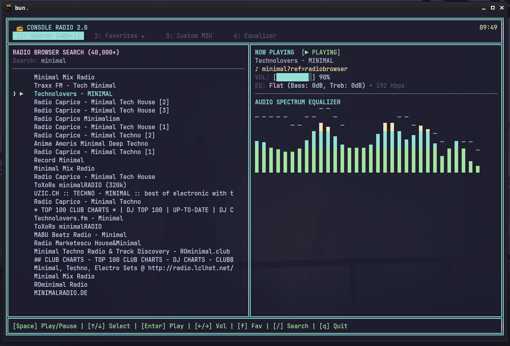

# 📻 ConsoleRadio 2.0

> Modern, lightweight, full-featured Terminal Internet Radio with dynamic animated ASCII/Unicode Equalizer, global search across 40,000+ live stations, favorites, and hotkeys.



```
╔══════════════════════════════════════════════════════════════════════════════╗
║  📻 CONSOLE RADIO 2.0                                                 09:30  ║
║  [1: Search (40k+)]   2: Favorites ★   3: Custom M3U   4: Equalizer          ║
╠═══════════════════════════════════╦══════════════════════════════════════════╣
║ RADIO BROWSER SEARCH (40,000+)    ║ NOW PLAYING  [▶ PLAYING]                 ║
║ Search: rock█                     ║ Classic Vinyl HD                         ║
║ ───────────────────────────────── ║ ♪ Led Zeppelin - Stairway To Heaven      ║
║ ❯ ▶ ★ Classic Vinyl HD            ║ VOL: [████████░░░░] 70%                  ║
║     102.7 KIIS FM                 ║ EQ: Rock / Metal (Bass: +5dB, Treb: +5dB)║
║     France Info                   ║ ──────────────────────────────────────── ║
║     CNN                           ║ AUDIO SPECTRUM EQUALIZER                 ║
║     RTL                           ║   █   ⎺   █   ⎺   █   █   ⎺   █          ║
║     Europe 1                      ║ █ █ █ █ █ █ █ █ █ █ █ █ █ █ █ █          ║
║     Rock Antenne                  ║ █ █ █ █ █ █ █ █ █ █ █ █ █ █ █ █          ║
╠═══════════════════════════════════╩══════════════════════════════════════════╣
║ [Space] Play/Pause | [↑/↓] Select | [Enter] Play | [←/→] Vol | [/] Search    ║
╚══════════════════════════════════════════════════════════════════════════════╝
```

---

## ✨ Features

- 🔍 **Global Live Search:** Greeted immediately with global search powered by the Radio Browser API (40,000+ stations worldwide). Press `/` to search by genre, artist, country, or tag (`rock`, `jazz`, `synthwave`, `ambient`, `lofi`, `classical`...).
- 🎚️ **Animated Audio Spectrum Equalizer:** Dynamic real-time multi-band visualizer (` `, `▂`, `▃`, `▄`, `▅`, `▆`, `▇`, `█`) with physics-based peak gravity decay (`⎺`).
- 🎛️ **Audio EQ Controls & Presets:** Adjust **Bass** (`b` / `Shift + B`) and **Treble** (`t` / `Shift + T`) on the fly via hardware audio filters, plus quick presets: *Flat, Bass Boost, Rock / Metal, Electronic, Jazz, Classical, Vocal, Treble Boost*.
- ★ **Favorites Management:** Bookmark any station to your favorites with a single keystroke (`f`), persisted to `favorites.json`.
- 🔗 **Custom Stream & M3U Playback:** Stream any direct URL or `.m3u` / `.m3u8` playlist on demand (`u`).
- 🎶 **Live Track Metadata:** Real-time ICY title updates showing the currently playing artist and track name.
- ⚡ **Zero External Dependencies:** Built entirely with vanilla Node.js and direct MPV UNIX IPC socket communication. Instant startup, no `node_modules` clutter.

---

## 🚀 Quick Start

### Requirements
- **Node.js** (v18+)
- **mpv** (`sudo pacman -S mpv` on Arch Linux, or `sudo apt install mpv` on Ubuntu/Debian)

### Run
```bash
# Clone the repository
git clone git@github.com:denistol/ConsoleRadio.git
cd ConsoleRadio

# Switch to dev branch
git checkout dev

# Launch immediately
node index.js
# or
npm start
```

---

## ⌨️ Hotkeys Reference

| Key | Action |
|---|---|
| **`/`** | **Open Global Search** (type genre, country, or station name) |
| **`Enter`** | Play highlighted station |
| **`↑` / `↓`** | Navigate station list |
| **`Space`** | Toggle Play / Pause |
| **`←` / `→`** (or `[` / `]`) | Decrease / Increase Volume |
| **`m`** | Toggle Mute |
| **`1` – `4`** (or `Tab`) | Switch tabs: *Search, Favorites, Custom M3U, Equalizer* |
| **`f`** | Add / Remove station from **Favorites ★** |
| **`e`** | Cycle Equalizer Presets |
| **`b` / `B`** | Decrease / Increase **Bass** (-12 to +12 dB) |
| **`t` / `T`** | Decrease / Increase **Treble** (-12 to +12 dB) |
| **`u`** | Play **Custom URL / M3U** stream |
| **`q`** or `Ctrl + C` | Clean exit |
